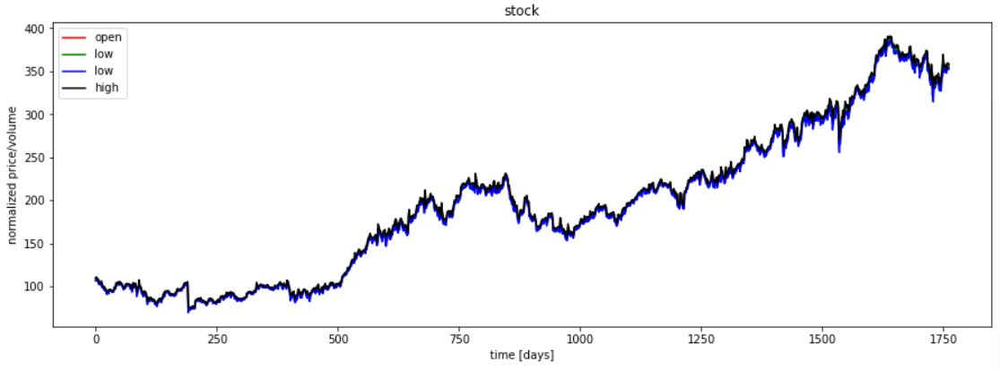
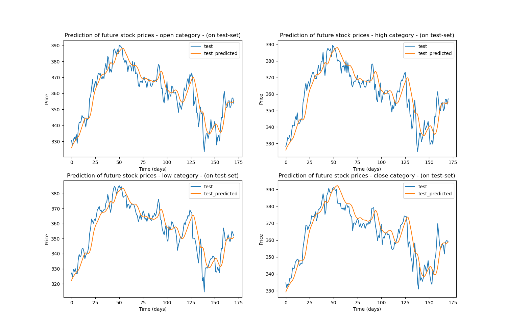

# New York Stock Exchange Prediction

This project aims to model NYSE data. The data used for this project can be found [here](data/prices-split-adjusted.csv). Inorder to download the entire NYSE data, please check the original [Kaggle Competition](https://www.kaggle.com/dgawlik/nyse)

 

## Description of files

* `nyse.py` : The parent file that is used for both training and testing. Saved model will be stored in `ckpt`.

* `model.py`: This file consists the RNN model that would be employed.

* `utils.py`: This file contains helper functions for loading data, training and testing.

## Example usage

```
    python nyse.py
```

## Results



Examining the predictions on the test set on all the four stock categories, we can infer that the model is able to capture the trend in the data. 

Notice that the model prediction is same across all the four categories. This might be because there exists only minor changes across these categories and therefore, the model is attempting to be robust to these changes.

## Things to experiment on

* The current model is a simple RNN. One can use other variants of RNN such as LSTM and GRU.
* We can also try implementing a transformer network (which was revolutionary in language translation) for this problem.
* Include more features such as additional income, capital expenditure etc.
* Scaling this data sometimes worsens the prediction. In that case, find an optimal scaling mechanism.


